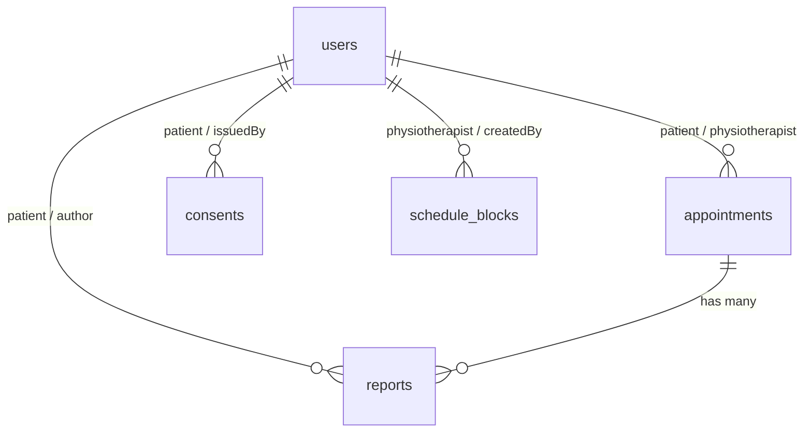

# Memoria Técnica Definitiva - PhysioSafe CRM

**Última actualización**: 27 de mayo de 2026

PhysioSafe es un CRM clínico diseñado para digitalizar y centralizar las operaciones de una clínica de fisioterapia. Cubre la admisión automatizada de pacientes, la agenda de citas con protección de solapes en zona horaria local, informes clínicos con control de bloqueos, consentimientos informados con firma digital criptográfica y seguridad basada en roles.

---

## 1. Módulos y Funcionalidades del CRM

### 1.1 Control de Acceso y Gestión de Sesión
- **Roles**:
  - **Administrador**: Acceso total. Gestión de altas, bajas lógicas y roles de usuarios internos (creación de fisioterapeutas y administradores).
  - **Fisioterapeuta**: Gestión clínica. Creación de informes de evolución, emisión de consentimientos, y bloqueo de su agenda personal.
  - **Paciente**: Acceso personal. Solicitud de citas en huecos libres reales, consulta de sus informes de evolución, y firma o revocación de consentimientos.
- **Gestión de Sesión**: Implementada en `public/session.js` mediante una capa adaptadora que utiliza `localStorage` con caída automática a `sessionStorage` o cookies si el navegador tiene políticas estrictas de privacidad.

### 1.2 Módulo de Agenda y Disponibilidad Real
- **Reglas del Calendario**:
  - Horario base de lunes a viernes, de **09:00 a 18:00** en zona horaria de la clínica (`Europe/Madrid`).
  - Duración estándar por cita de **60 minutos**.
- **Control de Solapes Concurrente**:
  - **Fisioterapeuta**: Evita que un fisioterapeuta tenga dos citas programadas o pendientes en el mismo rango de tiempo.
  - **Paciente**: Evita que un paciente pueda reservar dos citas simultáneas con profesionales distintos.
- **Bloqueos de Agenda (`ScheduleBlock`)**: Permite a fisioterapeutas (su propia agenda) o administradores (clínica completa) bloquear días específicos como no laborables (festivos, vacaciones). Las citas en estos días quedan deshabilitadas y se marcan como no disponibles.

### 1.3 Módulos Clínico y Legal (Reportes y Consentimientos)
- **Reportes Clínicos**:
  - Clasificados en: evolución, diagnóstico, alta e incidencia.
  - Pueden ser bloqueados (`isLocked`) por el administrador para evitar modificaciones ulteriores.
  - Los fisioterapeutas tienen acceso de lectura a todos los informes para garantizar la continuidad asistencial del paciente, pero solo pueden editar o eliminar los que ellos mismos redactaron.
- **Consentimientos Informados**:
  - Clasificados en: tratamiento, protección de datos, uso de imagen y teleconsulta.
  - Firmados por el paciente mediante un hash criptográfico SHA-256 único, generado a partir del ID de consentimiento, ID del paciente, nombre del firmante y marca de tiempo exacta de la firma.
  - Soportan transiciones de estado reguladas: *Pendiente -> Firmado -> Revocado* o *Expirado*.

### 1.4 Admisión y Triaje Asistido (Integración con Typebot)
- **Endpoint**: `POST /api/typebot/intake` protegido mediante cabecera `x-physiosafe-typebot-secret`.
- **Triaje**: El asistente clasifica la urgencia clínica analizando palabras clave (dolor intenso, traumatismos, fiebre, hormigueos progresivos, pérdida de fuerza o control de esfínteres). Asigna prioridades: `revision_prioritaria`, `preferente` o `normal`.
- **Admisión Automática**:
  - Si el paciente no existe, crea una ficha nueva con password aleatorio. Si existe (incluso si está desactivado/borrado lógico), restaura su cuenta y acumula las notas clínicas.
  - Genera automáticamente una cita de valoración en el primer hueco disponible dentro de los próximos **60 días laborables** que coincida con las preferencias de turno (mañana o tarde) declaradas por el paciente.
  - **Tolerancia a Fallos y Asignación Resiliente**:
    - **Fisioterapeuta**: Si el fisioterapeuta seleccionado en el triaje no está registrado, no existe o está inactivo, el sistema lo reasigna automáticamente al primer fisioterapeuta activo en el sistema, o en su defecto, al primer administrador activo de la clínica (evitando errores 400).
    - **Hueco no disponible**: Si el hueco de cita solicitado por el paciente está ocupado, coincide con un día no laborable o está fuera del horario base, el sistema no rechaza la admisión (error 409/400); en su lugar, busca de manera proactiva el primer hueco alternativo disponible dentro del rango de 60 días según la preferencia horaria.

---

## 2. Arquitectura de Datos (Modelos de Sequelize)

La base de datos utiliza **PostgreSQL** administrada a través del ORM Sequelize con nombres de columna normalizados en snake_case (`underscored: true`) y borrados lógicos para mantener el historial (`paranoid: true`).

### 2.1 Modelo: `User` (Tabla: `users`)
- Representa a todas las personas en el sistema.
- **Campos**:
  - `id`: UUID (Clave Primaria).
  - `name`: String(120), no nulo.
  - `email`: String(160), único, no nulo.
  - `passwordHash`: String, no nulo.
  - `role`: ENUM('admin', 'fisioterapeuta', 'paciente'), por defecto 'paciente'.
  - `phone`: String(30).
  - `dni`: String(30), único.
  - `birthDate`: DateOnly.
  - `medicalNotes`: Text.
  - `isActive`: Boolean, por defecto true.
  - `lastLoginAt`: Date.

### 2.2 Modelo: `Appointment` (Tabla: `appointments`)
- Representa las sesiones clínicas programadas o solicitadas.
- **Campos**:
  - `id`: UUID (Clave Primaria).
  - `patientId`: UUID, clave foránea (ref: users).
  - `physiotherapistId`: UUID, clave foránea (ref: users).
  - `title`: String(140), no nulo.
  - `treatmentType`: String(100), por defecto 'Sesión de fisioterapia'.
  - `startsAt`: Date (UTC), no nulo.
  - `endsAt`: Date (UTC), no nulo.
  - `status`: ENUM('pending', 'scheduled', 'completed', 'validated', 'cancelled', 'no_show').
  - `room`: String(60).
  - `notes`: Text.

### 2.3 Modelo: `Report` (Tabla: `reports`)
- Almacena el historial clínico de las evoluciones del paciente.
- **Campos**:
  - `id`: UUID (Clave Primaria).
  - `patientId`: UUID, clave foránea (ref: users).
  - `authorId`: UUID, clave foránea (ref: users).
  - `appointmentId`: UUID, clave foránea (ref: appointments).
  - `type`: ENUM('evolution', 'diagnostic', 'discharge', 'incident').
  - `title`: String(160), no nulo.
  - `content`: Text, no nulo.
  - `diagnosis`: Text.
  - `treatmentPlan`: Text.
  - `isLocked`: Boolean, por defecto false.

### 2.4 Modelo: `Consent` (Tabla: `consents`)
- Gestiona los documentos de consentimiento legal del paciente.
- **Campos**:
  - `id`: UUID (Clave Primaria).
  - `patientId`: UUID, clave foránea (ref: users).
  - `issuedById`: UUID, clave foránea (ref: users).
  - `type`: ENUM('treatment', 'data_processing', 'image_use', 'telehealth').
  - `status`: ENUM('pending', 'signed', 'revoked', 'expired').
  - `title`: String(160), no nulo.
  - `body`: Text, no nulo.
  - `signatureName`: String(120).
  - `signatureHash`: String(128).
  - `signedAt`: Date.
  - `revokedAt`: Date.
  - `expiresAt`: Date.

### 2.5 Modelo: `ScheduleBlock` (Tabla: `schedule_blocks`)
- Almacena días bloqueados de vacaciones o festivos.
- **Campos**:
  - `id`: UUID (Clave Primaria).
  - `physiotherapistId`: UUID, clave foránea (ref: users, opcional).
  - `createdById`: UUID, clave foránea (ref: users).
  - `date`: DateOnly, no nulo.
  - `reason`: String(180), por defecto 'Día no laborable'.

---

## 3. Flujos Críticos y Lógica de Zona Horaria

Para garantizar que PhysioSafe funcione de manera predecible en cualquier infraestructura en la nube (que usualmente corren en hora UTC), la aplicación desacopla el huso horario de la máquina del huso de operación clínica (`Europe/Madrid`).

1. **Backend - Utilidades del Huso**:
   - `getMadridOffset(date)`: Formatea la fecha dada usando la zona de Madrid y extrae el desfase dinámico (UTC+1 en invierno, UTC+2 en verano).
   - `getMadridTimeInfo(date)`: Retorna la hora, el minuto y el día de la semana correspondiente a esa marca en España.
   - `createMadridDate(dateStr, hour, minute)`: Crea un objeto `Date` de Javascript compensado de tal manera que, al ser guardado en la base de datos como UTC, corresponda exactamente a la hora y minuto locales en Madrid.
2. **Validaciones en Calendario**:
   - Comprobación de fin de semana (`isWeekend`): Evalúa el día de la semana resultante tras aplicar el huso madrileño. Evita solapamientos o desajustes los domingos a última hora o viernes por la noche.
   - Apertura laboral: Se asegura de que la cita empiece después de las 09:00 y termine antes de las 18:00 locales (Madrid).
3. **Frontend - Calendario y Rangos**:
   - Las consultas de disponibilidad no transmiten desfases horarios intermedios. El frontend solicita el rango enviando las fechas limpias de su zona (`YYYY-MM-DD`).
   - El backend procesa las franjas completas en la zona de Madrid (`createMadridDate(date, 0, 0)` hasta `createMadridDate(date, 23, 59)`) y retorna los huecos disponibles con etiquetas precisas basadas en el huso local.

---

## 4. Pila Tecnológica y Despliegue en Producción

### 4.1 Tecnologías Utilizadas
- **Backend**: Node.js v20+, Express, Sequelize, JSON Web Tokens (JWT) y Bcrypt (12 rondas de cifrado).
- **Frontend**: HTML5 Semántico, CSS3 Vanilla (diseño responsivo y animaciones adaptativas), Vanilla JavaScript.
- **Base de Datos**: PostgreSQL 15.
- **Ingreso de Lead**: Typebot (Viewer y Builder autoalojados).
- **Servicio Periférico**: Nginx Proxy Manager (SSL automatizado y enrutamiento inverso).

### 4.2 Despliegue con Docker Compose
La infraestructura está contenida en un fichero `docker-compose.yml` que enruta de manera aislada los servicios en la red virtual `physio-network`:
- **physiosafe_db**: Servidor de base de datos principal Postgres (volumen persistido).
- **physiosafe_web**: Servidor Express que corre en producción.
- **physiosafe_typebot_db**: Servidor Postgres independiente para el motor de Typebot.
- **physiosafe_bot_viewer**: Lector público del Typebot (admisiones en vivo).
- **physiosafe_bot_builder**: Constructor administrativo del Typebot.
- **physiosafe_npm**: Nginx Proxy Manager expuesto en puertos 80/443 para el control de dominios y certificados SSL.
